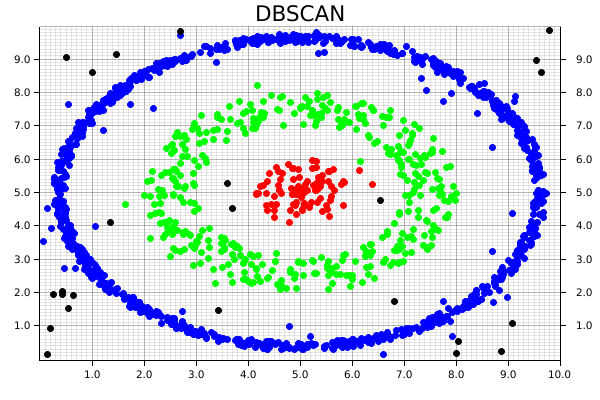

### Using DBSCAN with `linfa-clustering`

 
```rust,no_run
{{#include ../code/examples/kmeans.rs:create_squares}}
```


```rust,no_run
{{#include ../code/examples/kmeans.rs:create_model}}
```


```rust,no_run
{{#include ../code/examples/kmeans.rs:run_model}}
```

```rust,no_run
{{#include ../code/examples/kmeans.rs:build_chart_base}}
```


```rust,no_run
{{#include ../code/examples/kmeans.rs:configure_chart}}
```


```rust,no_run
{{#include ../code/examples/kmeans.rs:run_check_for_plotting}}
```


```rust,no_run
{{#include ../code/examples/kmeans.rs:plot_points}}
```




Now we can compare these results to the same dataset that is clustered by the KMeans algorithm. In this case, the KMeans algorithm was manually set to find 3 clusters (remember, DBSCAN automatically calculates the number of clusters based on the provided parameters).

